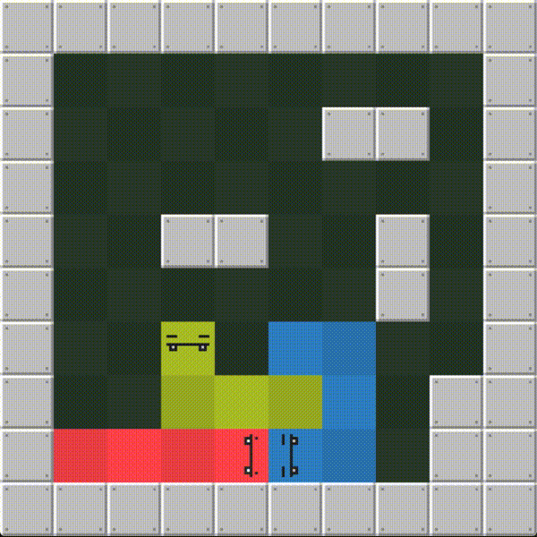

# Snake Fab

A clone of the [Snakebird](https://store.steampowered.com/app/357300/Snakebird/) mechanics using C and [SDL](https://www.libsdl.org/).



## Setup for macOS

[SDL](https://www.libsdl.org/release/SDL2-2.0.12.zip) and [SDL_image](https://www.libsdl.org/tmp/SDL_image/release/SDL2_image-2.0.5.zip) are required.

```
brew install sdl2 sdl2_image
make
./build/snake-fab
```

## Controls
- Arrow keys - move
- Spacebar - swap
- Backspace - undo
- R - restart